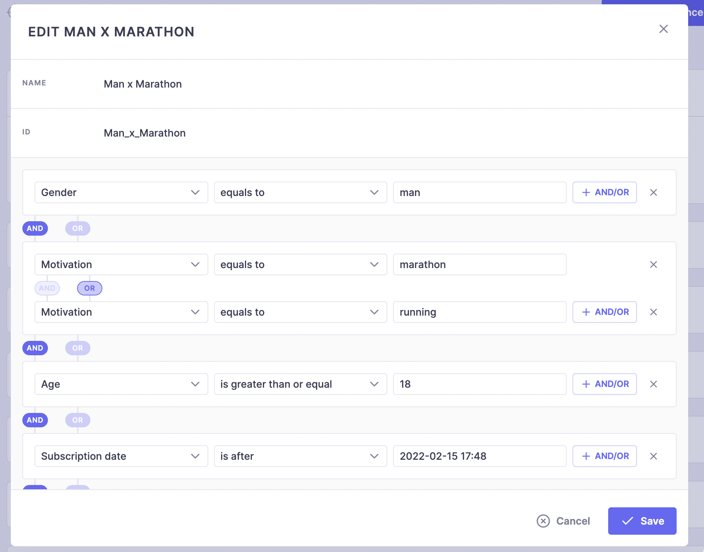

# Audiences


Starting with the following versions of SDKs, you can set user attributes to create Audiences:

* iOS: 3.4.0
* Android: 3.4.0
* ReactNative: 2.4.0
* Cordova: 2.4.0
* Flutter: 1.4.0

Audiences can be created in our Console and applied to specific [placements](../quick-start-1/sdk-configuration/config-appendices/present-paywalls.md) so that in your application you have nothing to change to display a paywall for an audience, as usual you just decide when you want to display a specific placement that will automatically display the paywall depending on the user context (audiences and a/b test)

An audience is a combinaison of user attributes, you can create as many user attributes as you wish with those specific type:

1. String
2. Int
3. Float
4. Boolean
5. Date


<figure><figcaption><p>An example of an audience with a combinaison of user attributes</p></figcaption></figure>

Once you have created the user attributes you are interested in, in your application you send those attributes with their values to our SDK. Purchasely will then compute automatically the audience based on those attributes

### Sending attributes

All values type must be the exact same than the ones you have set in Purchasely console, for exemple if you have setup an `Age` property with the key `age` and the type `Int` then in your code your have to set it with an integer value like `Purchasely.setUserAttribute("age", 21)`



```swift
//Set one attribute by key and value
Purchasely.setUserAttribute(withIntValue: 20, forKey: "age")
Purchasely.setUserAttribute(withDoubleValue: 175.5, forKey: "size")
Purchasely.setUserAttribute(withBoolValue: true, forKey: "subscribed")
Purchasely.setUserAttribute(withDateValue: Date(), forKey: "date")
Purchasely.setUserAttribute(withStringValue: "Female", forKey: "gender")

//Remove one attribute
Purchasely.clearUserAttribute(forKey: "size")

//Set multiple attributes
 Purchasely.setUserAttributes(
            [
            "age": 20,
            "size": 175.5,
            "subscribed": true,
            "date": Date(),
            "gender": "Female"
            ]
        )
                
//Remove all attributes
Purchasely.clearUserAttributes()
```



```kotlin
//Set one attribute by key and value
Purchasely.setUserAttribute("age", 20)

//Set multiple attributes
Purchasely.setUserAttributes(mapOf(
    Pair("age", 21),
    Pair("gender", "man"),
    Pair("hair", "brown"),
))

//Remove one attribute
Purchasely.clearUserAttribute("hair")

//Remove all attributes
Purchasely.clearUserAttributes()
```



```java
//Set one attribute by key and value
Purchasely.setUserAttribute("age", 20);

//Set multiple attributes
HashMap<String, Object> map = new HashMap<>();
map.put("age", 21);
map.put("gender", "man");
map.put("hair", "brown");
Purchasely.setUserAttributes(map);
        
//Remove one attribute
Purchasely.clearUserAttribute("hair");

//Remove all attributes
Purchasely.clearUserAttributes();
```



```javascript
//Set one attribute by key and value
Purchasely.setUserAttributeWithString("gender", "man");
Purchasely.setUserAttributeWithNumber("age", 21);
Purchasely.setUserAttributeWithNumber("weight", 78.2);
Purchasely.setUserAttributeWithBoolean("premium", true);
Purchasely.setUserAttributeWithDate("subscription_date", new Date());

//Remove one attribute
Purchasely.clearUserAttribute("premium")

//Remove all attributes
Purchasely.clearUserAttributes()
```



```javascript
```



```dart
```



```csharp
private PurchaselyRuntime.Purchasely _purchasely;

//Set one attribute by key and value
_purchasely.SetUserAttribute("StringAttribute", "String message");
_purchasely.SetUserAttribute("IntAttribute", -100);
_purchasely.SetUserAttribute("FloatAttribute", 147.5f);
_purchasely.SetUserAttribute("BoolAttribute", true);
_purchasely.SetUserAttribute("DateAttribute", DateTime.Now);

//Remove one attribute
_purchasely.ClearUserAttribute("StringAttribute");
	
//Remove all attributes
_purchasely.ClearUserAttributes();
```




You should call Purchasely.clearUserAttributes() when a user is logged out, after calling Purchasely.userLogout(), so that he does not keep attributes you have set previously with his profile.\
Be aware though, this method remove all attributes so you must set device attributes again&#x20;


### Retrieving attributes



```swift
//return an int since it was set with that type
if let age =  Purchasely.getUserAttribute(for: "age") as? Int {
    // Do Something
}

//return a dictionary of all attributes
Purchasely.userAttributes.forEach { attribute in
    print("Attribute \(attribute.key) = \(attribute.value)")
}
```



```kotlin
//return an int since it was set with that type
val age = Purchasely.userAttribute("age") 

//return a map of all attributes
val all = Purchasely.userAttributes()
all.forEach { attribute ->
    Log.d("Purchasely", "Attribute ${attribute.key} = ${attribute.value}")
}
```



```java
//return an int since it was set with that type
int age = (int) Purchasely.userAttribute("age");

//return a map of all attributes
Map<String, Object> all = Purchasely.userAttributes();
for (String key : all.keySet()) {
    Log.d("Purchasely", "Attribute" + key + " = " + all.get(key));
}
```



```javascript
//get all attributes
const attributes = await Purchasely.userAttributes();
console.log(attributes); //returns a PurchaselyUserAttribute object with key and value

//retrive a date attribute
const dateAttribute = await Purchasely.userAttribute("subscription_date"); //returns the value
//for a date you need to parse the iso 8601 string to retrieve the date object
console.log(new Date(dateAttribute).getFullYear());
```



```csharp
private PurchaselyRuntime.Purchasely _purchasely;

_purchasely.GetUserAttribute("AttributeID")
```


