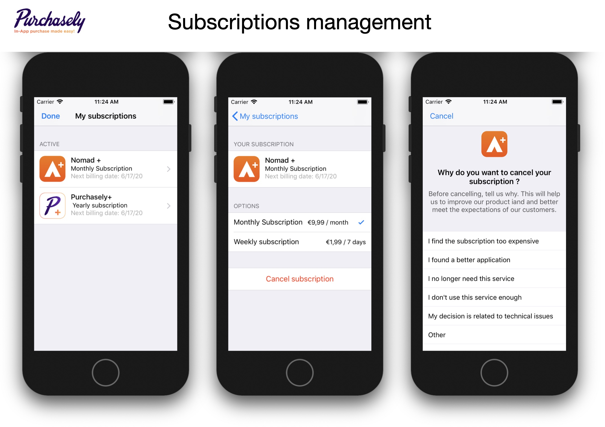

# Displaying users subscriptions

We believe that your customers should be able to unsubscribe as easily as they subscribed. This leads to a better global trust and offers some interesting opportunities like offering an upsell or downsell or getting to know why they choose to unsubscribe.

We provide a complete active subscriptions handling flow that you can call with a single line of code and that offers:

* Active subscriptions list
* Next renewal date
* Upsell / downsell
* Cancellation survey
* Cancellation



You can get the subscriptions list root controller by calling



```swift
// ⚠️ The controller must be added to a UINavigationController
let ctrl = Purchasely.subscriptionsController()
```



```objectivec
// ⚠️ The controller must be added to a UINavigationController
UIViewController *ctrl = [Purchasely subscriptionsController];
```



```kotlin
supportFragmentManager.beginTransaction()
    .addToBackStack(null)
    .replace(R.id.subscriptionsFragment, Purchasely.subscriptionsFragment(), "SubscriptionsFragment")
    .commitAllowingStateLoss()
```



```java
getSupportFragmentManager().beginTransaction()
    .addToBackStack(null)
    .replace(R.id.subscriptionsFragment, Purchasely.subscriptionsFragment(), "SubscriptionsFragment")
    .commitAllowingStateLoss();
```



```javascript
Purchasely.presentSubscriptions();
```



```javascript
Purchasely.presentSubscriptions();
```



```dart
try {
  Purchasely.presentSubscriptions();
} catch (e) {
  print(e);
}
```



