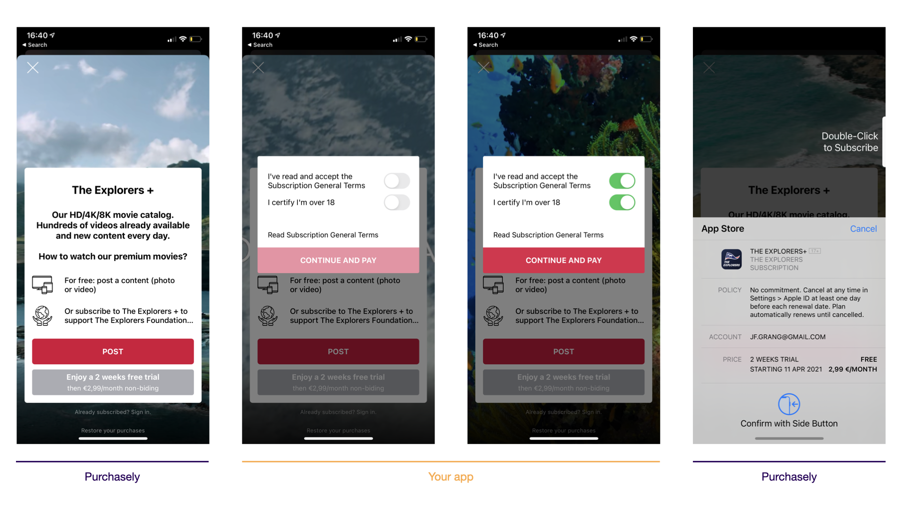

# Paywall action interceptor


This feature replaces both Login and Purchase interceptor with a more generic approach.&#x20;


Starting with v3.0, Purchasely allow you to intercept and override every paywall action.

This can be used to:

* `paywallObserver` mode: intercept purchase and restore actions to perform them using your own code or another SDK&#x20;
* Intercept the login button tapped to display your login form
* Force the explicit acceptance of terms and conditions before a purchase
* Intercept the call to a webview to inject credentials and be directly logged in&#x20;
* Block promo codes in Kids category apps to add a parental permission gate
* Block direct access to external content (webview or link to Safari) in Kids category apps to add a parental permission gate

With the action interceptor, you get everything you need to:

* Get the action (and context)
* Display views, errors, messages, … above our paywalls
* Choose if Purchasely should continue the action or not

<figure><figcaption></figcaption></figure>

You can intercept the following buttons being tapped:

* Close
* Login
* Navigate (web or deeplink)
* Purchase
* Restore
* Open another paywall
* Promo code

## Implementation

The interceptor passes 4 parameters:

1. `action`, the `PLYPresentationAction` enum that gives the type of action
2. `parameters`, a dictionary that contains the objects needed to perform the action (like a `PLYPlan` for a purchase)
3. `info`, the `PLYPresentationInfo` object containing the controller of the paywall to dismiss it or display content / error messages above it, and the presentation id and content id associated to this paywall
4.  `proceed` a completion handler parameter with a boolean telling Purchasely if it should continue the action itself.

    i.e. : Returning true on a purchase action will lead Purchasely to trigger the purchase


On a login action, call `proceed(true) to refresh the paywall if the user has logged in`



If you don't handle every action, you **HAVE TO** call `proceed(true)` otherwise the bouton will keep spinning and nothing will happen.




```swift
Purchasely.setPaywallActionsInterceptor { [weak self] (action, parameters, info, proceed) in

	switch action {
	
	// Intercept the tap on login
	case .login:
		// When the user has completed the process
		// Pass true to reload the paywall if user is logged in
		self?.presentLogin(above: info?.controller) { (loggedIn) in
			Purchasely.userLogin(with: "MY_USER_ID")
			proceed(loggedIn)
		}
	
	// Intercept the tap on purchase to display the terms and condition
	case .purchase:
		self?.presentTermsAndConditions(above: info?.controller) { (userAcceptedTerms) in
			proceed(userAcceptedTerms)
		}
	default:
		proceed(true)
		break
	}
}

```



```objectivec
[Purchasely setPaywallActionsInterceptor:^(enum PLYPresentationAction action, PLYPresentationActionParameters *parameters, PLYPresentationInfo *info, void (^ proceed)(BOOL)) {
        switch (action) {
                
            // Intercept the tap on login
            case PLYPresentationActionLogin:{
                // When the user has completed the process
                //Pass true to reload the paywall if user is logged in
                
                [self presentLoginAbove:info.controller completion:^(BOOL loggedIn) {
                    [Purchasely userLoginWith:@"MY_USER_ID"];
                    proceed(loggedIn);
                }];
                break;
            }
                
            // Intercept the tap on purchase to display the terms and condition
            case PLYPresentationActionPurchase:{
                [self presentTermsAndConditionsAbove:info.controller completion:^(BOOL userAcceptedTerms) {
                    proceed(userAcceptedTerms);
                }];
                break;
            }
            default:
                proceed(YES);
                break;
        }
    }];
```



```kotlin
Purchasely.setPaywallActionsInterceptor { info, action, parameters, processAction ->
    if (info?.activity == null) return@setPaywallActionsInterceptor

    when(action) {
        PLYPresentationAction.PURCHASE -> {
            presentTermsAndConditions(info.activity) { userAcceptedTerms ->
    		// Don't forget to notify the SDK by calling `processAction`
    		processAction(userAcceptedTerms)
        }
        PLYPresentationAction.LOGIN -> {
            // Call your method to display your view 
            // and return boolean result to userLoggedIn
            presentLogin(info.activity) { userLoggedIn ->
                Purchasely.userLogin("MY_USER_ID")
    		// Pass true to reload the paywall if user is logged in
    		processAction(userLoggedIn)
            }
        }
        else -> {
            Log.d("PLYActionInterceptor", action.value + " " + parameters)
            processAction(true)
        }
    }
}
```



```java
Purchasely.setPaywallActionsInterceptor((info, action, parameters, listener) -> {
    //if there is no activity then there is nothing to display
    if (info == null || info.getActivity() == null) return;

    switch (action) {
        case PURCHASE:
            //present your terms and call 
            //listener.processAction(true) if accepted
            //or listener.processAction(false) if not to cancel purchase
            presentTermsAndConditions(info.getActivity(), listener);
            break;
        case LOGIN:
            // call your method to display your view
            // and return boolean result to listener
            // Pass true to reload the paywall if user is logged in
            // listener.processAction(true);
            presentLogin(info.getActivity(), listener);
            break;
        default:
            listener.processAction(true);
    }
});
```



```javascript
Purchasely.setPaywallActionInterceptorCallback((result) => {
    console.log('Received action from paywall ' + result.info.presentationId);

    if (result.action === PLYPaywallAction.NAVIGATE) {
      console.log(
        'User wants to navigate to website ' +
          result.parameters.title +
          ' ' +
          result.parameters.url
      );
      Purchasely.onProcessAction(true);
    } else if (result.action === PLYPaywallAction.CLOSE) {
      console.log('User wants to close paywall');
      Purchasely.onProcessAction(true);
    } else if (result.action === PLYPaywallAction.LOGIN) {
      console.log('User wants to login');
      //Present your own screen for user to log in
      Purchasely.closePaywall();
      Purchasely.userLogin('MY_USER_ID');
      //Call this method to update Purchasely Paywall
      Purchasely.onProcessAction(true);
    } else if (result.action === PLYPaywallAction.OPEN_PRESENTATION) {
      console.log('User wants to open a new paywall');
      Purchasely.onProcessAction(true);
    } else if (result.action === PLYPaywallAction.PURCHASE) {
      console.log('User wants to purchase');
      //If you want to intercept it, close paywall and display your screen
      Purchasely.closePaywall();
    } else if (result.action === PLYPaywallAction.RESTORE) {
      console.log('User wants to restore his purchases');
      Purchasely.onProcessAction(true);
    } else {
      console.log('Action unknown ' + result.action);
      Purchasely.onProcessAction(true);
    }
  });
```



```javascript
Purchasely.setPaywallActionInterceptor((result) => {
	console.log('Received action from paywall' + result.info.presentationId);
	
	if (result.action === Purchasely.PaywallAction.navigate) {
		console.log(
		'User wants to navigate to website ' +
			result.parameters.title +
			' ' +
			result.parameters.url
		);
		Purchasely.onProcessAction(true);
	} else if (result.action === Purchasely.PaywallAction.close) {
		console.log('User wants to close paywall');
		Purchasely.onProcessAction(true);
	} else if (result.action === Purchasely.PaywallAction.login) {
		console.log('User wants to login');
		//Present your own screen for user to log in
		Purchasely.closePaywall();
		Purchasely.userLogin('MY_USER_ID');
		//Call this method to update Purchasely Paywall
		Purchasely.onProcessAction(true);
	} else if (result.action === Purchasely.PaywallAction.open_presentation) {
		console.log('User wants to open a new paywall');
		Purchasely.onProcessAction(true);
	} else if (result.action === Purchasely.PaywallAction.purchase) {
		console.log('User wants to purchase');
		//If you want to intercept it, close paywall and display your screen
		Purchasely.closePaywall();
	} else if (result.action === Purchasely.PaywallAction.restore) {
		console.log('User wants to restore his purchases');
		Purchasely.onProcessAction(true);
	} else {
		console.log('Action unknown ' + result.action);
		Purchasely.onProcessAction(true);
	}
});
```



```dart
Purchasely.setPaywallActionInterceptorCallback(
          (PaywallActionInterceptorResult result) {
  if (result.action == PLYPaywallAction.navigate) {
    print('User wants to navigate');
    Purchasely.onProcessAction(true);
  } else if (result.action == PLYPaywallAction.close) {
    print('User wants to close paywall');
    Purchasely.onProcessAction(false);
  } else if (result.action == PLYPaywallAction.login) {
    print('User wants to login');
    //Present your own screen for user to log in
    Purchasely.closePaywall();
    Purchasely.userLogin('MY_USER_ID');
    //Call this method to update Purchasely Paywall
    Purchasely.onProcessAction(true);
  } else if (result.action == PLYPaywallAction.open_presentation) {
    print('User wants to open a new paywall');
    Purchasely.onProcessAction(true);
  } else if (result.action == PLYPaywallAction.purchase) {
    print('User wants to purchase');
    //If you want to intercept it, close paywall and display your screen
    Purchasely.closePaywall();
    Purchasely.onProcessAction(false);
  } else if (result.action == PLYPaywallAction.restore) {
    print('User wants to restore his purchases');
    Purchasely.onProcessAction(true);
  } else {
    print('Action unknown ' + result.action.toString());
    Purchasely.onProcessAction(true);
  }
});
```



```csharp
private PurchaselyRuntime.Purchasely _purchasely;

_purchasely.SetPaywallActionInterceptor(OnPaywallActionIntercepted);

private void OnPaywallActionIntercepted(PaywallAction action)
{
    Log($"Purchasely Paywall Action Intercepted. Action: {action.action}.");
}
```


