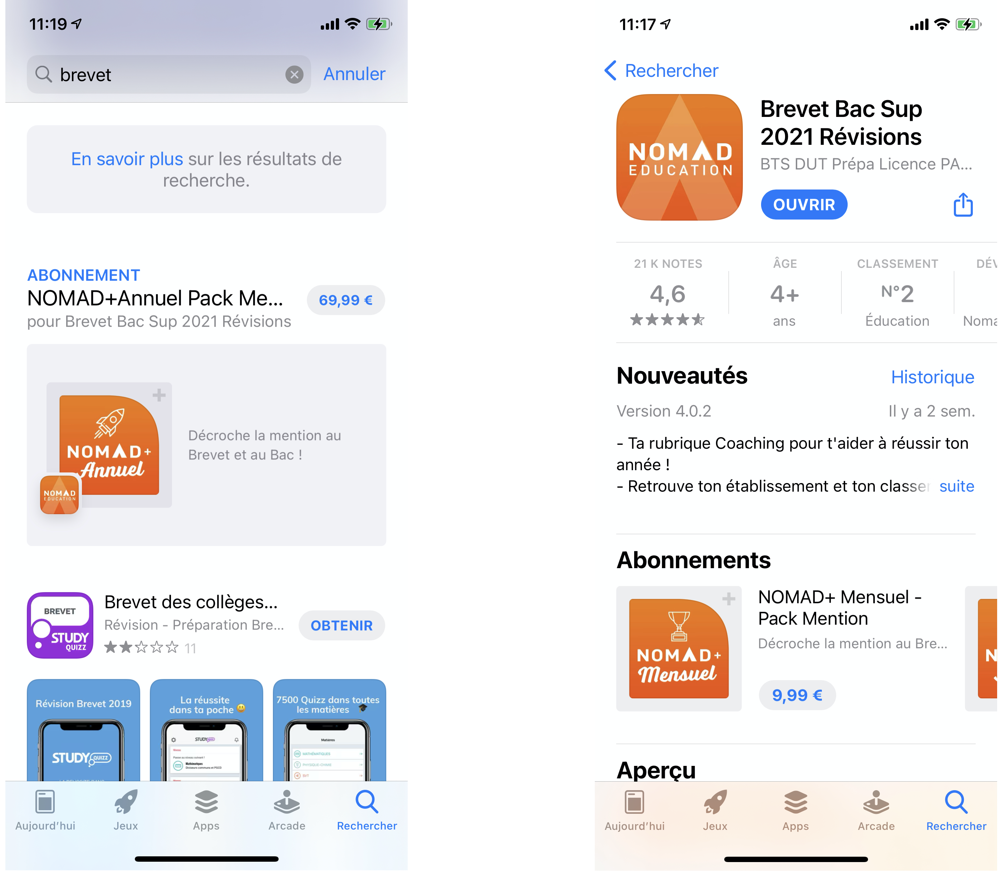

# Promoting In-App Purchases


Only available on iOS SDK


### What are promoted In-App Purchases

You can use the [Promoting In App Purchase feature](https://developer.apple.com/app-store/promoting-in-app-purchases/) to increase the visibility of your purchases in the App Store. These items are searchable on the App Store and can be purchased directly from the store.

It is a great way to improve your ASO and conversion.



### Choosing the visual

In App Store Connect, you will select the App Store product (a plan) to promote and add a promotional artwork following [Apple Guidelines](https://developer.apple.com/app-store/promoting-in-app-purchases/).

In Purchasley console, select the presentation associated to that plan and that will be displayed before the purchase.

### Implementation

Here is **what we do for you**:

* Once a product is purchased we make sure that it won't be visible on the App Store page of your app to make more room to other products you might be selling\\
* Apple says: "_If you are offering an auto-renewable subscription, you’ll need to explain how auto-renewal works in the purchase flow within your app_".\
  In that case we pop the product offer paywall once your app is started.

To ensure that we won't be popping the paywall during on boarding or loading … you need to call the following method when your app is ready:



```swift
Purchasely.readyToOpenDeeplink(true)
```



### Testing

To test the flow before you submit your app or your promotion, you can do the following:

```
itms-services://?action=purchaseIntent&bundleId=APP_BUNDLE_ID&productIdentifier=IN_APP_PRODUCT_ID
```

Replace `APP_BUNDLE_ID` and `IN_APP_PRODUCT_ID` by the appropriate values and paste it into Notes app. Clicking on it will start a purchase action just like the App Store would.
