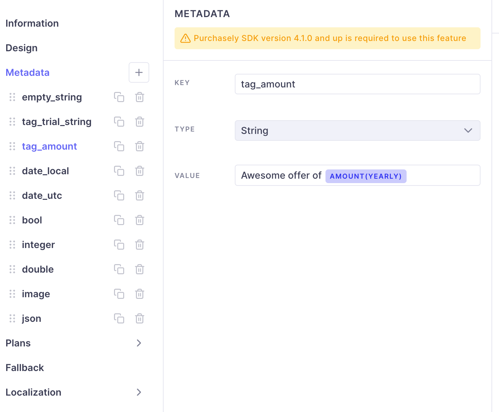
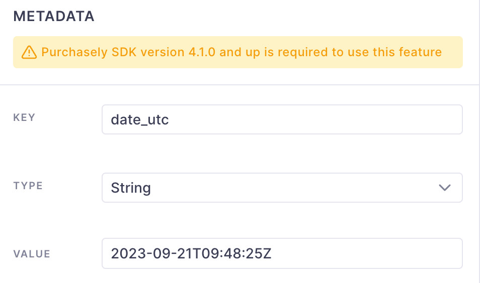
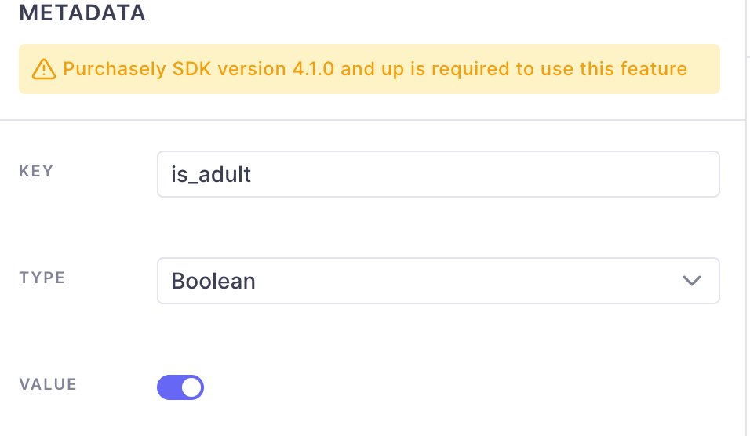
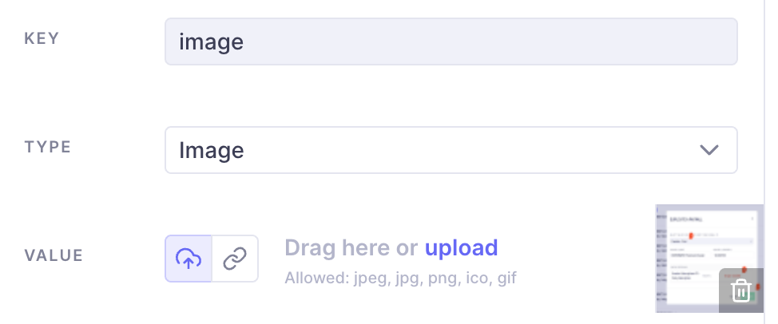

# Use your own paywall


The feature described in this section is supported on the following versions and above:

* iOS: 3.5.0
* Android: 3.5.0
* ReactNative: 2.5.0
* Cordova: 2.5.0
* Flutter: 1.5.0


It could sound weird to use your home made paywall in a No Code paywall environment but it is indeed very useful to:

* A/A test your paywall against the same one implemented using Purchasely's template
* Test your existing paywall against one of our No Code paywall and run tests to beat your reference
* Easily deploy [price A/B testing](https://help.purchasely.io/en/articles/6990589-price-a-b-test) infrastructure without changing your UI

## Implementation

The [basic paywall implementation](../quick-start-1/sdk-configuration/config-appendices/present-paywalls.md) directly returns a piece of UI but to be able to make both your paywall alongside with Purchasely's paywalls you will need to proceed differently.\
\
First, you must [declare your own paywall](https://help.purchasely.io/en/articles/6940803-your-own-paywall-in-the-purchasely-console) in our console along with the plans you wish to offer on your paywall if you want to do [price A/B tests](https://help.purchasely.io/en/articles/6990589-price-a-b-test)

Then you will need to fetch the paywalls and therefore you won't be able to directly display a screen returned by Purchasely.

You will have to first fetch the paywall then check whether you should display your own paywall or display the provided paywall.\\



```swift
Purchasely.fetchPresentation(for: "onboarding", fetchCompletion: { presentation, error in
            guard let presentation = presentation, error == nil else {
                print("Error while fetching presentation: \(error?.localizedDescription ?? "unknown")")
                return
            }
            
            if presentation.type == .normal || presentation.type == .fallback {
                let paywallController = presentation.controller
                
                // display paywall controller.
                
            } else if presentation.type == .deactivated {
                
                // nothing to display
                
            } else if presentation.type == .client {
                let presentationId = presentation.id
                let plans = presentation.plans
                let metadata = presentation.metadata // look section below
                
                // display your own paywall
                
            }
        })
```



```objectivec
[Purchasely fetchPresentationFor:@"onboarding" fetchCompletion:^(PLYPresentation * _Nullable presentation, NSError * _Nullable error) {
        if (error != nil) {
            NSLog(@"Error while fetching presentation: %@", error.localizedDescription);
            return;
        }
        
        if (presentation.type == PLYPresentationTypeNormal || presentation.type == PLYPresentationTypeFallback) {
            PLYPresentationViewController *paywallController = presentation.controller;
            
            // display paywall controller.
            
        } else if (presentation.type == PLYPresentationTypeDeactivated) {
            
            // nothing to display
            
        } else if (presentation.type == PLYPresentationTypeClient) {
            NSString *presentationId = presentation.id;
            NSArray<NSString *> *plans = presentation.plans;
            
            //display your own paywall
            
        }
    } completion:nil];
```



```kotlin
Purchasely.fetchPresentationForPlacement(this, "onboarding") { presentation, error ->
    if(error != null) {
        Log.d("Purchasely", "Error fetching paywall", error)
        return@fetchPresentationForPlacement
    }

    when(presentation?.type) {
        PLYPresentationType.NORMAL,
        PLYPresentationType.FALLBACK -> {
            val paywallView = presentation.buildView(
                context = this@MainActivity,
                viewProperties = PLYPresentationViewProperties(
                    onClose = {
                        // TODO remove view
                    }
                )
            )
            // Display Purchasely paywall
        }
        PLYPresentationType.DEACTIVATED -> {
            // Nothing to display
        }
        PLYPresentationType.CLIENT -> {
            val paywallId = presentation.id
            val plans = presentation.plans
            val metadata = presentation.metadata // look section below
            
            // Display your own paywall
        }
        else -> {
            //No presentation, it means an error was triggered
        }
    }
}
```



<pre class="language-java"><code class="lang-java"><strong>Purchasely.fetchPresentationForPlacement(
</strong>    this, 
    "onboarding", 
    null,
    (presentation, error) -> {
        if(error != null) {
            Log.d("Purchasely", "Error fetching paywall", error);
            return null;
        }
        
        if(presentation.getType() == PLYPresentationType.CLIENT) {
            String paywallId = presentation.getId();
            List&#x3C;String> planIds = presentation.getPlans();
            // Display your own paywall
        }
        
        return null;
<strong>    }
</strong><strong>);
</strong></code></pre>



```typescript
try {
  // Fetch presentation to display
  const presentation = await Purchasely.fetchPresentation({
      placementId: 'onboarding'
  })

  if(presentation.type == PLYPresentationType.CLIENT) {
    // Display my own paywall
    return
  }

} catch (e) {
  console.error(e);
}
```



```dart
try {
  var presentation = await Purchasely.fetchPresentation("ONBOARDING");

  if (presentation == null) {
    print("No presentation found");
    return;
  }

  if (presentation.type == PLYPresentationType.deactivated) {
    // No paywall to display
    return;
  }

  if (presentation.type == PLYPresentationType.client) {
    // Display my own paywall
    return;
  }

  //Display Purchasely paywall

  var presentResult = await Purchasely.presentPresentation(presentation,
      isFullscreen: false);

  switch (presentResult.result) {
    case PLYPurchaseResult.cancelled:
      {
        print("User cancelled purchased");
      }
      break;
    case PLYPurchaseResult.purchased:
      {
        print("User purchased ${presentResult.plan?.name}");
      }
      break;
    case PLYPurchaseResult.restored:
      {
        print("User restored ${presentResult.plan?.name}");
      }
      break;
  }
} catch (e) {
  print(e);
}
```



```javascript
// coming soon
```



Then call `clientPresentationDisplayed(presentation)` when your paywall is displayed and `clientPresentationClosed(presentation)` when your paywall is closed.

These steps are mandatory for Purchasely to compute conversion on your paywall and measure the performance of A/B tests.



```swift
// Call when your paywall is displayed
// in ViewDidAppear for example
Purchasely.clientPresentationOpened(with: presentation)
            
// Call when your paywall has been closed
// in viewWillDisappear for example
Purchasely.clientPresentationClosed(with: presentation)

// Call clientPresentationClosed in Purchasely.syncPurchase() closure 
// if you are in paywallObserverMode
```



```objectivec
// Call when your paywall is displayed
// in ViewDidAppear for example
[Purchasely clientPresentationOpenedWith:presentation];
            
// Call when your paywall has been closed
// in viewWillDisappear for example
[Purchasely clientPresentationClosedWith:presentation];
```



```kotlin
// Call when your paywall is displayed
// For example in the onCreate() method of your Activity
Purchasely.clientPresentationDisplayed(presentation)

// Call when your paywall is closed
// For example in the onDestroy() method of your Activity
Purchasely.clientPresentationClosed(presentation)
```



```java
// Call when your paywall is displayed
// For example in the onCreate() method of your Activity
Purchasely.clientPresentationDisplayed(presentation);

// Call when your paywall is closed
// For example in the onDestroy() method of your Activity
Purchasely.clientPresentationClosed(presentation);
```



<pre class="language-typescript"><code class="lang-typescript">// Call when your paywall is displayed
<strong>Purchasely.clientPresentationDisplayed(presentation);
</strong>
// Call when your paywall is closed
Purchasely.clientPresentationClosed(presentation);

</code></pre>



```dart
// Call when your paywall is displayed
Purchasely.clientPresentationDisplayed(presentation);

// Call when your paywall is closed
Purchasely.clientPresentationClosed(presentation);
```



```javascript
```




You can of course start the purchase from your own paywall with Purchasely by using `Purchasely.purchase(plan)`, more information [here](manually-trigger-purchases.md)


## Metadata


Available starting with SDK 4.1.0



<div>

<figure><figcaption></figcaption></figure>

 

<figure><figcaption></figcaption></figure>

 

<figure><figcaption></figcaption></figure>

 

<figure><figcaption><p>Example of Metadata</p></figcaption></figure>

</div>

You can declare your metadata with Your Own Paywall which can be:

* String (but you can set different types with it, look at example code below)
* Image
* Boolean

These steps are mandatory for Purchasely to compute conversion on your paywall and measure the performance of A/B tests.



```swift
// Documentation coming soon

// Look at Kotlin example as it is the same methods
```



```kotlin
Purchasely.fetchPresentationForPlacement(this, "onboarding") { presentation, error ->
    if(error != null) {
        Log.d("Purchasely", "Error fetching paywall", error)
        return@fetchPresentationForPlacement
    }
    
    if(presentation?.type == PLYPresentationType.CLIENT) {
        val paywallId = presentation.id
        val plans = presentation.plans
        val metadata = presentation.metadata
        
        // Get string metadata, this method is asynchronous as it will parse tags
        val myString = metadata.getString("myString", callback = {
            Log.d("Demo", "myString: $it")
        })
        // You can also use coroutine
        scope.launch {
            val myString = metadata.getString("myString")
        }
        
        // If you do not use Purchasely tags
        val myString2 = metadata.getStringWithoutTags("myString2")
        
        val myBoolean = metadata.getBoolean("myBoolean")

        // Even if declared as a String in our console, 
        // Purchasely SDK will automatically try to convert to specific type 
        // For example: "4.7" is a double or float
        val myInt = metadata.getInt("myInt")
        val myLong = metadata.getLong("myLong")
        val myFloat = metadata.getFloat("myFloat")
        val myDouble = metadata.getDouble("myDouble")
        
        // If you set a metadata with a String ISO 8601, you can retrieve the date
        // "2023-09-21T09:48:25Z"
        val myDate = metadata.getDate("myDate")
        // or Instant
        val myDateAsInstant = if (Build.VERSION.SDK_INT >= Build.VERSION_CODES.O) {
            metadata.getInstant("myDate")
        } else null
        
        // If you set a medata with a String which is a json, you can retrieve it
        // "{"name":"Stranger","int_value":4,"child":{"title":"Things"}}"
        val myJson = metadata.getJsonObject("myJson")
    }
}
```



```typescript
// Release coming soon
```



```dart
// Release coming soon
```




You can of course do the purchase transaction from your own paywall with Purchasely by using `Purchasely.purchase(plan)`, more information [here](manually-trigger-purchases.md)

