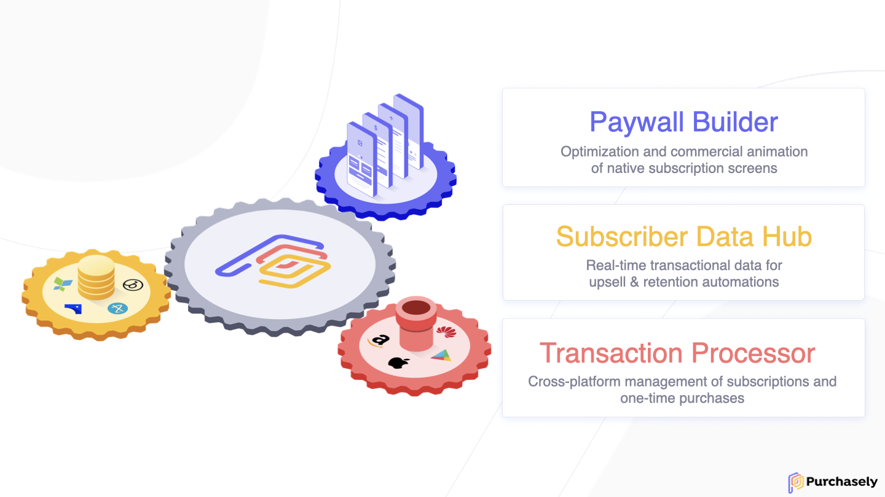

# Presentation

## Platform presentation

Purchasely combines a powerful Subscription Platform with a unique no-code native paywall technology.

It helps app developers to BUILD their in-app subscriptions stack and marketers to GROW their revenue by iterating on their paywalls and creating no-code automations.

The Purchasely Platform can be used in multiple ways:

* To perform purchases and process transactions
* To analyse purchases that were made with your own IAP system (aka _observer mode_)
* To display paywalls
* For everything listed above

## Platform modules

## Platform components

It is composed of :

* The Purchasely SDKs for iOS & Android that get integrated within your app
* The Purchasely Cloud Platform, which is a backend plugged with the Mobile Applications Store and your own backend
* The Purchasely Console, which allows you to access pretty much everything you need to make Purchasely Work

## The Purchasely SDK

This is the front component. There are 2 native SDKs : one for iOS and one for Android

* It is directly integrated within your mobile application. It is in charge of handling the entire subscription flow, from the display of the subscription sheet (also called product presentation) to the final validation of the subscription with the store
* The SDK directly retrieves the receipt from the App Store or the Play Store and sends it to the Purchasely Cloud Platform to validate it

## The Purchasely Cloud Platform

This is the the backend component

* It is plugged with the App Store, Google Play Store and the Huawei App Gallery. It receives direct server-to-server notifications when something new happens on a subscribers lifecycle
* The event received from the stores are directly forwarded to the Client Backend thanks to the unified Webhook (which normalizes the events from all the Stores)

## The Purchasely Console

This is the back office interface. It is a web interface to which only administrators have access. It has the following purposes :

* Managing the initial setup of the mobile applications
* Managing the Products & Plan catalog
* Managing the Presentations
* Consulting the subscribers lifecycle
* Consulting the consolidated subscriptions & revenues statistics
