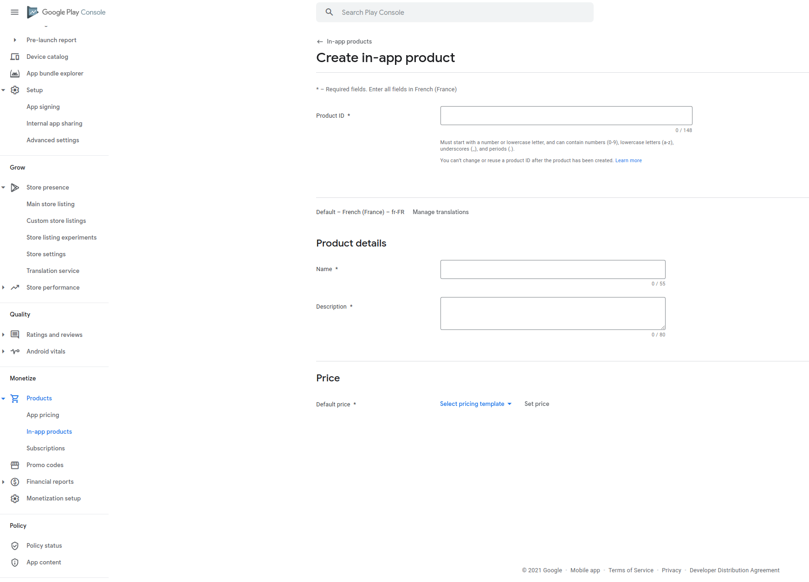

# Play Store

## Creating a new Subscription in the Google Play Store Console

1. Connect to the [Google Play Console](https://play.google.com/console) :&#x20;
2. Navigate to the following section:\
   _Google Play Console > All apps > \[YOUR APP] > Monetize > Products > Subscriptions_
3. Click on _Create subscription_
4. Fill in the **Product ID** and details such as name and description which will be displayed to the user
5. Add one or several **Base Plans** and their associated Pricings / Phases / Offers

<figure><figcaption>
Create a new Subscription entry
</figcaption></figure>

<figure><figcaption>
Add one or several base plans to the Susbcription
</figcaption></figure>

Don't forget to **Activate** the newly created **Base Plan** to make it available for purchase.


The value of the **Product ID,** **Base Plan ID** and **"Backwards Compatible"** parameters need to be mapped with the corresponding plan in the Purchasely Console.


<figure><figcaption>
Map Plan attributes in Purchasely Console according to Google Play Console
</figcaption></figure>


These updates in the Google Play Console may take some time - a few hours - to be available for internal or public testing


## Creating a new In-App product in the Google Play Store Console

1. Connect to the [Google Play Console](https://play.google.com/console)
2. Navigate to the following section:\
   _Google Play Console > All apps > \[YOUR APP] > Monetize > Products > In-app products_
3. Click on the 3 dots near _Import_ and select _Create product_
4. Fill in the **Product ID** and details such as name and description which will be displayed to the user
5. Adjust the price

The value of the **Product ID** parameter will be needed to be mapped with the corresponding plan in the Purchasely Console.


Google handles consumable and non consumables products but does not allow you to set it in their console. Use our dashboard to set your in-app product as consumable or non consumable and our SDK will handle the necessary process with Google Play.

