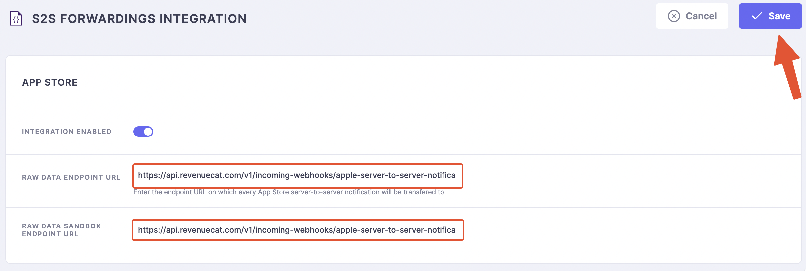
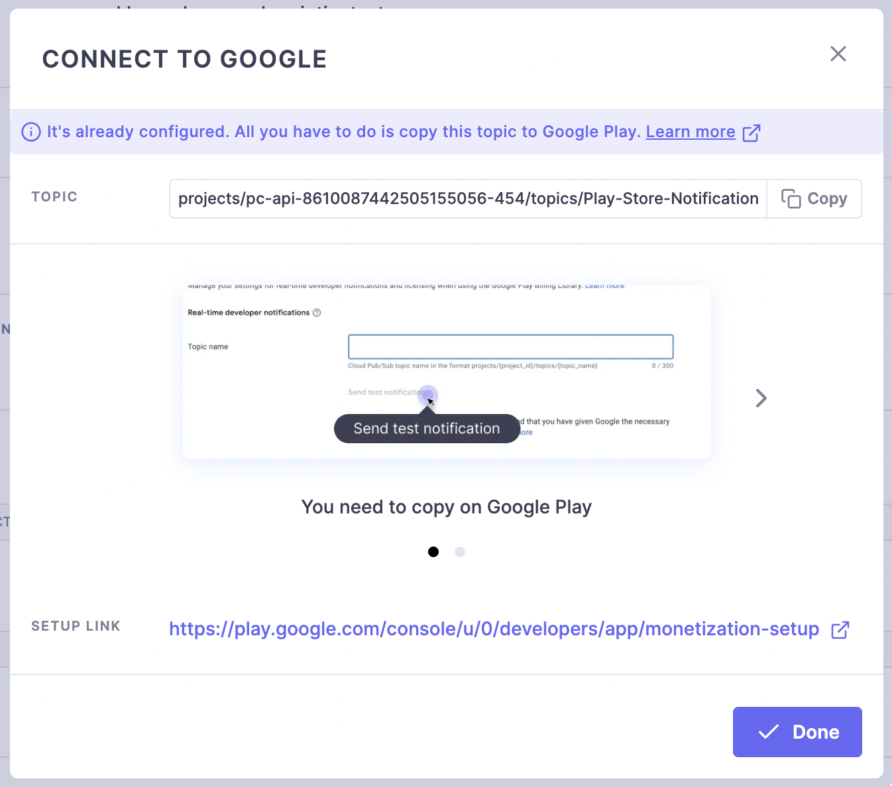

# Purchasely with RevenueCat

Purchasely can be used in a multitude of setups depending on the features you wish to enable.

One example is the Integration of Purchasely’s Paywall Builder with a 3rd party In-App Purchase management platform such as RevenueCat.

By adopting Purchasely on top of the existing payment infrastructure, you can achieve the following:

* Creating paywalls in record time without coding
* Determine the right pricing strategy and improve your value proposition
* Optimizing user journey and maximizing conversion with an unlimited number of experiments
* Ensure the best experience for your visitors on different devices


Please note that the article provides a step-by-step guide to integrating Purchasely with RevenueCat, but the same process can apply to any third-party payment platform.


**Prerequisite**: You must implement Purchasely SDK in your application and configure Server to Server notifications (S2S) to collect the RevenueCat generated subscription data in real-time.

## Console configuration

To grant Purchasely permission to connect to mobile app stores like Apple and Google on your behalf, you need to make a small setup in the Purchasely console.

Head to the [quick start guide](../quick-start/console-configuration.md) to learn more about the app store access setup.

**Note**: **there is no need to configure S2S notifications** at this stage. The article explains the S2S setup in the dedicated section below.


This will not remove any existing setup you may have done with your system or RevenueCat, Purchasely will get the same access in addition to the ones you already provided to other services.


### Products and plans

Once you’ve given Purchasely permission to connect to app stores, you need to set up your in-app products and subscription plans (the same information set up in the RevenueCat console) in the Purchasely console.

When duplicating the information, **please be aware of the discrepancy in the definition of a “plan” and a “product” used by RevenueCat and Purchasely**.

**In Purchasely’s terms**:\
A “plan” is an item (SKU) you sell on Apple/Google, such as a subscription, consumable or non-consumable. A “product” is a group of plans where you can manage upgrades and downgrades.

**In RevenueCat’s terms**:\
A “product” is an item (SKU) you sell on Apple/Google which is equivalent to what is defined as a “plan” by Purchasely.

Refer to [help center](https://help.purchasely.com/en/collections/3507048-products-plans) to learn more.

You can also provide us with [a csv file](../faq/migration-guides/migrate-from-an-existing-setup.md#1.-configure-your-app-products-plans-in-the-purchasely-console) to fill in all the correct information on your behalf.

## SDK implementation

You can [install](sdk-installation/) Purchasely SDK for your application in iOS and Android native, React Native, Flutter or Cordova. The process differs for each platform, but the SDK usage is almost equivalent.

### Configuration

The `start` method must be called **as soon as possible** to catch every purchase / renewal.



```swift
import Purchasely

func application(_ application: UIApplication, didFinishLaunchingWithOptions launchOptions: [UIApplicationLaunchOptionsKey: Any]?) -> Bool {
    Purchasely.start(withAPIKey: "API_KEY,
                         appUserId: nil,
			 runningMode: .paywallObserver,
			 eventDelegate: nil,
			 logLevel: .debug) { (success, error) in
		print(success)
        }
	return true
}
```



```objectivec
#import <Purchasely/Purchasely-Swift.h>

- (BOOL)application:(UIApplication *)application didFinishLaunchingWithOptions:(NSDictionary *)launchOptions {
	// Override point for customization after application launch.

	[Purchasely startWithAPIKey:@"API_KEY"
			  appUserId:@"USER_ID"
			runningMode: PLYRunningModePaywallObserver
	              eventDelegate:nil
			 uiDelegate:nil
	  paywallActionsInterceptor:nil
		           logLevel: LogLevelInfo
			initialized: nil];
	return YES;
}
```



```kotlin
import io.purchasely.ext.Purchasely

Purchasely.Builder(applicationContext)
    .apiKey("API_KEY")
    .logLevel(LogLevel.DEBUG) // set to warning or error for release
    .userId("USER_ID")
    .runningMode(PLYRunningMode.PaywallObserver)
    .stores(listOf(GoogleStore(), HuaweiStore()))
    .build()

// When you are ready for Purchasely to initialize,
// you must call start() method that will grab configuration and products
// from the selected stores.
Purchasely.start { isConfigured ->
}
```



```java
List<Store> stores = new ArrayList();
stores.add(new GoogleStore(), new HuaweiStore());

new Purchasely.Builder(getApplicationContext())
    .apiKey("API_KEY")
    .logLevel(LogLevel.DEBUG) // set to warning or error for release
    .userId("USER_ID")
    .runningMode(PLYRunningMode.Full.PaywallObserver)
    .stores(stores)
    .build();

// When you are ready for Purchasely to initialize,
// you must call start() method that will grab configuration and products
// from the selected stores.
Purchasely.start(isConfigured -> {
    null;
});
```



```javascript
import Purchasely from 'react-native-purchasely';

/**
* @params String apiKey
* @params StringArray stores : may be Google, Amazon and Huawei
* @params String userId
* @params Purchasley.LogLevel logLevel
* @params RunningMode runningMode
**/
Purchasely.startWithAPIKey(
  'API_KEY',
  ['Google'],
  'USER_ID',
  Purchasely.logLevelDebug,
  RunningMode.PaywallObserver
);

```



```javascript
/**
* @params String apiKey
* @params StringArray stores : may be Google, Amazon and Huawei
* @params String userId
* @params Purchasley.LogLevel logLevel
* @params Purchasely.RunningMode runningMode
**/
Purchasely.startWithAPIKey(
    'API_KEY', 
    ['Google'], 
    null, 
    Purchasely.LogLevel.DEBUG, 
    Purchasely.RunningMode.paywallObserver
);
```



```dart
/**
* @params String apiKey
* @params StringArray stores : may be Google, Amazon and Huawei
* @params String userId
* @params PLYLogLevel logLevel
* @params PLYRunningMode runningMode
**/
bool configured = await Purchasely.startWithApiKey(
        'API_KEY',
        ['Google'],
        null,
        PLYLogLevel.debug,
        PLYRunningMode.paywallObserver
    );
    
if (!configured) {
        print('Purchasely SDK not configured');
        return;
}
```



The `userID` parameter is optional and allows you to associate the purchase to a user instead of a device. You can also [set it up](sdk-configuration/config-appendices/set-user-id.md) later if you wish to.

The most important argument to set, besides `apiKey` , of course, is the `runningMode` in **paywallObserver**


In this mode, Purchasely will be able to display paywalls and observe transactions but will not process them and validate them with Apple and Google


### Display paywalls

All paywalls are displayed using Placements.

A Placement represents a specific location in your user journey inside your app (e.g., Onboarding, Settings, Home page, Article). A placement is linked to a paywall, and a single paywall can be used for different Placements. You can create as many Placements as you want, and it is the only thing that ties the app developer to the marketer.

Once the placements are defined and called from the app, you can change the displayed paywall remotely without any developer action.



```swift
let placementId = "ONBOARDING"
paywallCtrl = Purchasely.presentationController(for: placementId, contentId: contentId, loaded: { _, _, _ in
            }, completion: completion)
```



```objectivec
UIViewController *paywallCtrl = [Purchasely presentationControllerFor:@"my_placement_id"
						            contentId:@"my_content_id"
                                                            completion:^(enum PLYProductViewControllerResult result, PLYPlan * _Nullable plan) {
}];

```



```kotlin
val placementId = "onboarding"
val contentId = "my_content_id" //or null
Purchasely.presentationFragmentForPlacement(placementId, contentId) { result, plan ->
      Log.d("Purchasely", "Result is $result with plan $plan")
}
```



```java
String placementId = "onboarding"
String contentId = "my_content_id" //or null
Purchasely.presentationFragmentForPlacement(placementId, contentId);
```



```jsx
await Purchasely.presentPresentationForPlacement({
    placementVendorId: 'onboarding',
    contentId: 'my_content_id',
    isFullscreen: true,
});
```



```jsx
Purchasely.presentPresentationForPlacement('onboarding');
```



```jsx
await Purchasely.presentPresentationForPlacement('onboarding');
```



### Implement an Interceptor

Finally, you must use the Paywall Actions Interceptor in your purchase system to register the purchase triggered by Purchasely's paywalls.

Here is an example where RevenueCat is used to make the purchase, which requires you to [fetch products](https://www.revenuecat.com/docs/displaying-products) from their SDK and then [start the purchase](https://www.revenuecat.com/docs/making-purchases)



```swift
Purchasely.setPaywallActionsInterceptor { [weak self] (action, parameters, presentationInfos, proceed) in
	switch action {
		// Intercept the tap on purchase to display the terms and condition
		case .purchase:		
			// Grab the plan to purchase
			guard let plan = parameters?.plan, let appleProductId = plan.appleProductId else {
				return
			}

			Purchases.shared.getOfferings { (offerings, error) in
			    if let packages = offerings?.current?.availablePackages {
			        if( let package = packages.first { $0.storeProduct.productIdentifier == appleProductId}) {
					Purchases.shared.purchase(package: package) { (transaction, customerInfo, error, userCancelled) in
					  //stop process on Purchasely side
			                  proceed(false)
					  if customerInfo.entitlements["your_entitlement_id"]?.isActive == true {
					    // Unlock that great "pro" content              
					  }
					}
				}
			    }
			}
			
		case .restore:
			Purchases.shared.restorePurchases { customerInfo, error in
			    //stop process on Purchasely side
			    proceed(false)
			}
		default:
			proceed(true)
	}
}
```



```objectivec
[Purchasely setPaywallActionsInterceptor:^(enum PLYPresentationAction action, PLYPresentationActionParameters *parameters, PLYPresentationInfo *presentationInfos, void (^ proceed)(BOOL)) {
        switch (action) {
            // Intercept the tap on purchase to display the terms and condition
            case PLYPresentationActionPurchase:{
                // Grab the apple product id to purchase
                NSString *appleProductId = parameters.plan.appleProductId;
                
                [[RCPurchases sharedPurchases] offeringsWithCompletionBlock:^(RCOfferings *offerings, NSError *error) {
                  if (offerings.current && offerings.current.monthly) {
                    Package *package = offerings.current.monthly;
                    
                    //start the purchase
                    [[RCPurchases sharedPurchases] purchasePackage:package withCompletion:^(RCStoreTransaction *transaction, RCCustomerInfo *customerInfo, NSError *error, BOOL cancelled) {
                      //stop process on Purchasely side
		      proceed(false);
                      if (customerInfo.entitlements[@"your_entitlement_id"].isActive) {
                        // Unlock that great "pro" content
                      }
                    }];
                  } else if (error) {
                    // optional error handling
                  }
                }];

                break;
            }
            case PLYPresentationActionRestore:{
               //restore with RevenueCat
               [[RCPurchases sharedPurchases] restorePurchasesWithCompletion:^(RCCustomerInfo *customerInfo, NSError *error) {
                    //stop process on Purchasely side
		    proceed(false);
                }];
            }
            default:
                proceed(true);
                break;
        }
    }];
```



```kotlin
Purchasely.setPaywallActionsInterceptor { info, action, parameters, processAction ->
    when(action) {
        PLYPresentationAction.PURCHASE -> {
            val sku = parameters?.plan?.store_product_id
            
            //get RevenueCat package
            Purchases.sharedInstance.getOfferingsWith({ error ->
            // An error occurred
            }) { offerings ->
                offerings.current
                    ?.availablePackages
                    ?.takeUnless { it.isNullOrEmpty() }
                    ?.let { list ->
                     val rcPackage = list.firstOrNull { it.product.sku == sku }
                     
                     Purchases.sharedInstance.purchasePackage(
                        this,
                        rcPackage,
                        onError = { error, userCancelled -> 
                            /* No purchase */
                            //stop process on Purchasely side
			    processAction(false)
                        },
                        onSuccess = { product, customerInfo ->
                            //stop process on Purchasely side
			    processAction(false)
                            if (customerInfo.entitlements["my_entitlement_identifier"]?.isActive == true) {
                                // Unlock that content and synchronize with Purchasely
                                Purchasely.synchronize()
                            }
                    })
                }
            }
        }
        PLYPresentationAction.RESTORE -> {
           // restore purchases with RevenueCat
            Purchases.sharedInstance.restorePurchases(::showError) { customerInfo ->
                //... check customerInfo to see if entitlement is now active
                
                //one this is done, stop Purchasely process and synchronize
	        processAction(false)
                Purchasely.synchronize()
            }
        }
        else -> processAction(true)
    }
}
```



```java
Purchasely.setPaywallActionsInterceptor((info, action, parameters, listener) -> {
    switch (action) {
        case PURCHASE:
            if(parameters == null || parameters.plan == null) return
            
            String sku = parameters.plan.getStore_product_id();
            
            //get package from RevenueCat and start purchase
            Purchases.getSharedInstance().getOfferings(new ReceiveOfferingsListener() {
              @Override
              public void onReceived(@NonNull Offerings offerings) {
                if (offerings.getCurrent() != null) {
                  List<Package> availablePackages = offerings.getCurrent().getAvailablePackages();
                  Optional<Package> rcPackage = availablePackages
                            .stream()
                            .filter(aPackage -> aPackage.getProduct().getSku().equals(sku))
                            .findFirst();
                    
                    if(rcPackage.isPresent()) {
                        Purchases.getSharedInstance().purchasePackage(
                            this,
                            rcPackage.get(),
                            new MakePurchaseListener() {
                                @Override
                                public void onCompleted(@NonNull Purchase purchase, @NonNull CustomerInfo customerInfo) {
                                    //stop Purchasely process
                                    listener.processAction(false);
                                    if (customerInfo.getEntitlements().get("my_entitlement_identifier").isActive()) {
                                      // Unlock that great "pro" content and synchronize with Purchasely
                                      Purchasely.synchronize()
                                    }
                                }
                        
                                @Override
                                public void onError(@NonNull PurchasesError error, Boolean userCancelled) {
                                  // No purchase
                                  listener.processAction(false);
                                }
                            }
                        );
                    }
                }
              }
              
              @Override
              public void onError(@NonNull PurchasesError error) {
                // An error occurred
              }
            });             
            break;
        case RESTORE:
            Purchases.getSharedInstance().restorePurchases(new ReceiveCustomerInfoCallback() {
                @Override
                public void onReceived(@android.support.annotation.Nullable CustomerInfo customerInfo, @android.support.annotation.Nullable PurchasesError error) {
                //... check customerInfo to see if entitlement is now active
                
                //stop Purchasely process
                listener.processAction(false);
                
                //one this is done, synchronize with Purchasely
                Purchasely.synchronize()  
              }
            });
            
            listener.processAction(false);          
            break;
        default:
            listener.processAction(true);
    }
});
```



```typescript
Purchasely.setPaywallActionInterceptorCallback((result) => {
    if (result.action === PLYPaywallAction.PURCHASE) {
      try {
        //the store product id (sku) the user clicked on in the paywall
        String storeProductId = result.parameters.plan.productId
        
        try {
          const offerings = await Purchases.getOfferings();
          if (offerings.current !== null && offerings.current.availablePackages.length !== 0) {
            //get your package
            const package = offerings.current.monthly;
            
            //and purchase with RevenueCat
            try {
              const {customerInfo, productIdentifier} = await Purchases.purchasePackage(package);
              Purchasely.onProcessAction(false);
              if (typeof customerInfo.entitlements.active.my_entitlement_identifier !== "undefined") {
                Purchasely.synchronize();
              }
            } catch (e) {
              Purchasely.onProcessAction(false);
              if (!e.userCancelled) {
                showError(e);
              }
            }
          }
        } catch (e) {
           Purchasely.onProcessAction(false);
        }
      } catch (e) {
        console.log(e);
        Purchasely.onProcessAction(false);
      }
    } else if (result.action === PLYPaywallAction.RESTORE) {
      try {
        const restore = await Purchases.restorePurchases();
        // ... check restored purchaserInfo to see if entitlement is now active
        
        Purchasely.onProcessAction(false);
        Purchasely.synchronize();
      } catch (e) {
        Purchasely.onProcessAction(false);
      }
    } else {
      Purchasely.onProcessAction(true);
    }
  });
```



```javascript
Purchasely.setPaywallActionInterceptorCallback((result) => {
    if (result.action === Purchasely.PaywallAction.purchase) {
      //the store product id (sku) the user clicked on in the paywall
      const storeProductId = result.parameters.plan.productId
      
      Purchases.getOfferings(
          offerings => {
            if (offerings.current && offerings.current.monthly) {  
              //get your package from RevenueCat
              const product = offerings.current.monthly;
             
              Purchases.purchasePackage(product, ({ productIdentifier, purchaserInfo }) => {
                  Purchasely.onProcessAction(false);
                  if (typeof purchaserInfo.entitlements.active.my_entitlement_identifier !== "undefined") {
                    // Unlock that great "pro" content and synchronize with Purchasely
                    Purchasely.synchronize();
                  }
                },
                ({error, userCancelled}) => {
                  // Error making purchase
                  Purchasely.onProcessAction(false);
                }
              );
  
            }
          },
          error => {
    
          }
      );
    } if (result.action === Purchasely.PaywallAction.restore) {
      Purchases.restoreTransactions(
        info => {
          Purchasely.onProcessAction(false);
          
          //... check purchaserInfo to see if entitlement is now active
          Purchasely.synchronize();
        },
        error => {
          // Error restoring purchases
          Purchasely.onProcessAction(false);
        }
      );
    } else {
      Purchasely.onProcessAction(true);
    }
  });
```



```dart
Purchasely.setPaywallActionInterceptorCallback(
          (PaywallActionInterceptorResult result) {
    if (result.action == PLYPaywallAction.purchase) {
      try {
        //the store product id (sku) the user clicked on in the paywall
        var productId = result.parameters.plan.productId
        
        Offerings offerings = await Purchases.getOfferings();
        if (offerings.current != null && offerings.current.monthly != null) {
          //get your product from revenuecat
          Product product = offerings.current.monthly.product;
          
          //start purchase
          PurchaserInfo purchaserInfo = await Purchases.purchasePackage(product);
          Purchasely.onProcessAction(false);
          if (purchaserInfo.entitlements.all["my_entitlement_identifier"].isActive) {
            // Unlock that great "pro" content
            Purchasely.synchronize();
          }
        }
      } catch (e) {
        Purchasely.onProcessAction(false);
        print(e);
      }
    } if (result.action == PLYPaywallAction.restore) {
      Purchasely.onProcessAction(false);
      
      try {
        PurchaserInfo restoredInfo = await Purchases.restoreTransactions();
        // ... check restored purchaserInfo to see if entitlement is now active
        Purchasely.onProcessAction(false);
        Purchasely.synchronize();
      } on PlatformException catch (e) {
        Purchasely.onProcessAction(false);
        // Error restoring purchases
      }
    } else {
      Purchasely.onProcessAction(true);
    }
 });
```




For **Android devices** only, when **a purchase or a restoration** is made with your current flow, call the `Purchasely.synchronize()` method so that new transactions are [caught](https://docs.purchasely.com/quick-start-1/sdk-configuration/paywall-observer-mode#4-sync-your-purchases-android-only) by our SDK (but not processed)


## Data processing

You can leverage Purchasely’s data processing capabilities in observer mode to get relevant and useful information about your user subscription journey. Purchasely computes and standardizes all data across stores in real-time.


Purchasely only **observes** the data from the SDK or directly from the stores with Server to Server notifications. It does not validate them or grand entitlements, and this can still be done with your In-App Purchase service.


### S2S notifications with Apple

App Store Connect only allows setting **one** endpoint url for S2S in production and sandbox mode. To circumvent this limitation, you can enable our `S2S Forwardings` integration in Purchasely console.\
In App Store Connect, you need to set the Purchasely url for S2S instead of the RevenueCat url

\
\
Then in Purchasely Console, you can set up a **S2S Forwardings** integration for Apple with RevenueCat endpoints

<div align="left">

<figure><figcaption></figcaption></figure>

 

<figure><figcaption></figcaption></figure>

 

<figure><figcaption></figcaption></figure>

</div>

You are all set! Purchasely and RevenueCat will communicate real-time information about your users' purchases with Apple.

### S2S notifications with Google

Server-to-Server notifications for Google are called [real-time developer notifications](https://developer.android.com/google/play/billing/rtdn-reference)\
It is possible to set up as many endpoints as you want to receive those notifications so that you can set up another for Purchasely.\
We provide an easy configuration in our console, where we connect directly to Google once you have provided your access key.

<figure><figcaption></figcaption></figure>

It’s most likely that you’ve already setup S2S in the RevenueCat environment. This means Play-Store-Notifications have already been created on Google Pub/Sub.\
Select the topic from the dropdown list to add Purchasely to the same topic.


Only one topic is set on Google Play Console to receive notifications in real time. A topic can have multiple endpoints (subscriptions in Google cloud console). Purchasely will add an endpoint to the same topic so that Google sends notifications to Purchasely and RevenueCat at the same time


<div align="left">

<figure><figcaption></figcaption></figure>

 

<figure><figcaption></figcaption></figure>

 

<figure><figcaption></figcaption></figure>

</div>

Once you have selected your topic (or created a new one if none exists), click on Next so that the setup can be done by Purchasely automatically.\
After that, you can follow the instructions to ensure the correct topic is configured on Google Play Console.

### Importing your existing users

Finally you can [import your existing user base](../faq/migration-guides/migrate-from-an-existing-setup.md#3.-extract-your-existing-subscriptions-into-a-csv) with active subscriptions and/or [setup an endpoint ](../faq/migration-guides/migrate-from-an-existing-setup.md#2.-send-us-every-new-subscription-created-on-you-side-with-a-call-on-our-api)to send to Purchasely every new subscriber until you are in production with our SDK

This will provide multiple benefits:

* Accurate and relevant data in our [dashboard](../analytics/dashboards/live.md) about your subscribers (active users, free trial, conversion, renewal disabled, grace period...)
* [Cohorts](../analytics/dashboards/cohorts.md) of your entire subscription base history
* Historical reconstitution of every subscription with all [related events](../analytics/events/webhook-events/subscription-events.md) coupled with financial data if the price was provided in the import file
* Recommendations from our customer experience for growth


Due to a technical limitation from Google API, we will retrieve **full historical data of an active subscription** and up to **60 days for an inactive subscription** with Google Play Billing

