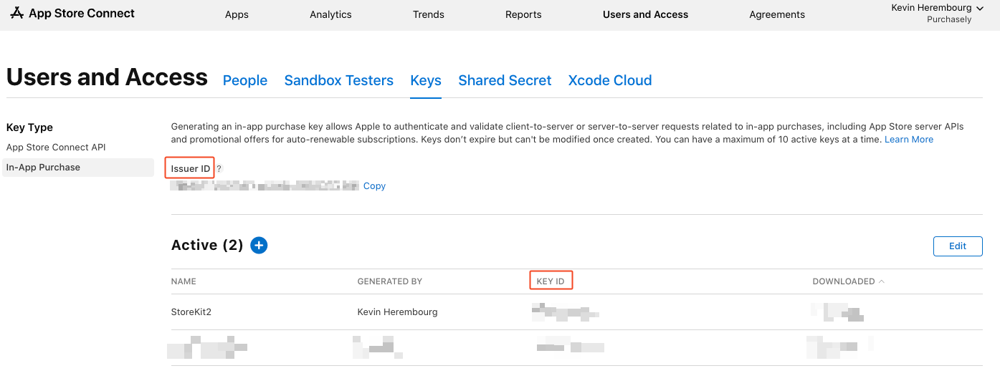
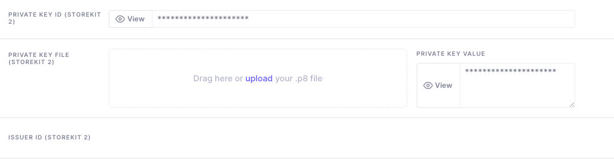

# StoreKit 2


To request StoreKit 2 usage, simply send an email to our support team or reach out to us via Intercom.&#x20;


Purchasely, by default, uses StoreKit 1 to initiate and process purchases on iOS devices. However, if you wish to enable StoreKit 2 for users on iOS 15 and above, see requirements below, you can make a request to our support team.\
\
Our team will assist you in enabling StoreKit 2 for your application, ensuring a seamless purchasing experience for your users on the latest iOS devices. \
Users with devices below minimum requirements will continue to uses StoreKit 1 under the hood.

## Configuration

Configuring StoreKit 2 with App Store Connect to allow Purchasely to verify transactions requires a [few steps](https://developer.apple.com/documentation/appstoreserverapi/creating\_api\_keys\_to\_use\_with\_the\_app\_store\_server\_api). Once completed, you can update your application settings in Purchasely console. This configuration is essential for using StoreKit 2 with Purchasely SDK.

#### **Enable App Store Connect API access**

* Sign in to [App Store Connect](https://appstoreconnect.apple.com/access/api/subs)
* Go to "Users and Access"
* Select "Keys" under the "In-App Purchase" section
* Click on the "+" button to generate a new API key
* Choose a name for the key and click "Generate"
* Download the API key file (`.p8`), and note the **Key ID** and **Issuer ID**. Keep the file secure, as you won't be able to download it again

<figure><figcaption></figcaption></figure>

#### Setup StoreKit2 on Purchasely Console

* Connect to [Purchasely Console](https://console.purchasely.io/)
* Go to "App Settings"
* Select Apple App Store" under the "Store configuration" section
* Fill in the **Private Key Id** from the key you generated
* Upload your Private Key File (`.p8`)
* Fill your **Issuer Id**
* Click on **Save** in the top right corner

<figure><figcaption></figcaption></figure>

## Implementation

In order to activate StoreKit 2 for compatible devices within the Purchasely SDK, follow these steps to update your implementation:

1.  **Enable StoreKit 2 flag**

    Add the `storeKit2` flag to the `Purchasely.start()` method in your app's initialization code. This will enable StoreKit 2 for users on compatible devices (iOS 15 and above).

    ```swift
    Purchasely.start(
        withApiKey: "API_KEY",
        storekitSettings: StorekitSettings(
            shouldUseStorekit2IfAvailable: true, 
            simulateAskToBuy: false)
    )
    ```
2.  **Handling purchases and restorations (Paywall Observer mode)**

    If you are using the Purchasely SDK in [Paywall Observer mode](paywall-observer-mode.md), it is essential to call `Purchasely.syncPurchase()` once a purchase or restoration has been processed. This allows the SDK to be aware of new transactions and ensures accurate data reporting for A/B tests and paywall conversion.

    After processing a purchase or restoration, call

    ```swift
    try await Purchasely.syncPurchase(for: "apple product id")
    ```

### Complete code sample



```swift
Purchasely.start(
    withApiKey: "API_KEY",
    appUserId: "USER_ID",
    runningMode: .full,
    eventDelegate: nil,
    uiDelegate: nil,
    paywallActionsInterceptor: nil,
    storekitSettings: StorekitSettings(shouldUseStorekit2IfAvailable: true, simulateAskToBuy: false),
    logLevel: .debug,
    initialized: nil
)

// Call syncPurchase if you are in paywallObserver mode after your purchase has been done.
try await Purchasely.syncPurchase(for: "apple-product-id")

```



```objectivec
[Purchasely startWithAPIKey:@"API_KEY"
                      appUserId:@"USER_ID"
                    runningMode:PLYRunningModeFull
                  eventDelegate:nil
                     uiDelegate:nil
      paywallActionsInterceptor:nil
               storekitSettings:[[StorekitSettings alloc] initWithShouldUseStorekit2IfAvailable:YES simulateAskToBuy:NO]
                       logLevel:LogLevelDebug
                    initialized:nil];
                    
 // Call syncPurchase if you are in paywallObserver mode after your purchase has been done.
 [Purchasely syncPurchaseFor:@"apple-product-id" completionHandler:^(NSError * _Nullable error) {
    // Handle Error.    
    }];
```



#### &#x20;Purchasely SDK

* iOS: 3.5.0

#### **OS version** (built with Xcode 14 or later)&#x20;

* iOS 15
* iPadOS 15
* macOS 12
* tvOS 15
* watchOS 8


