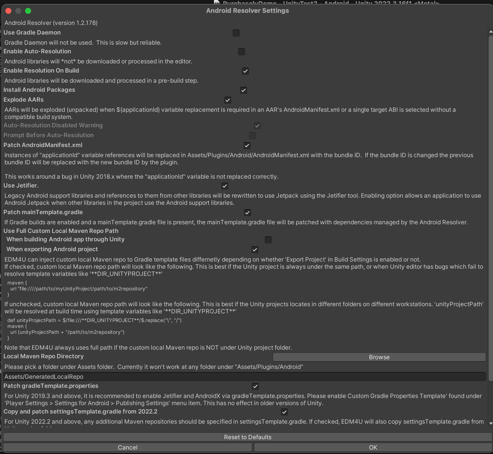
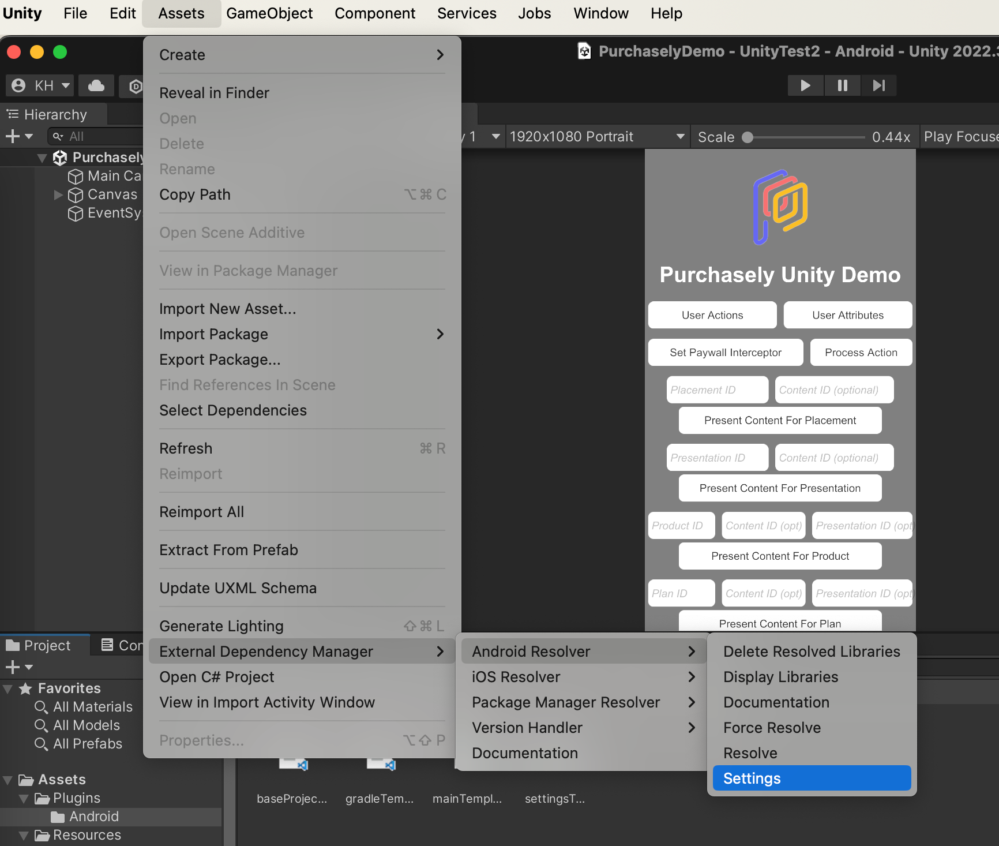
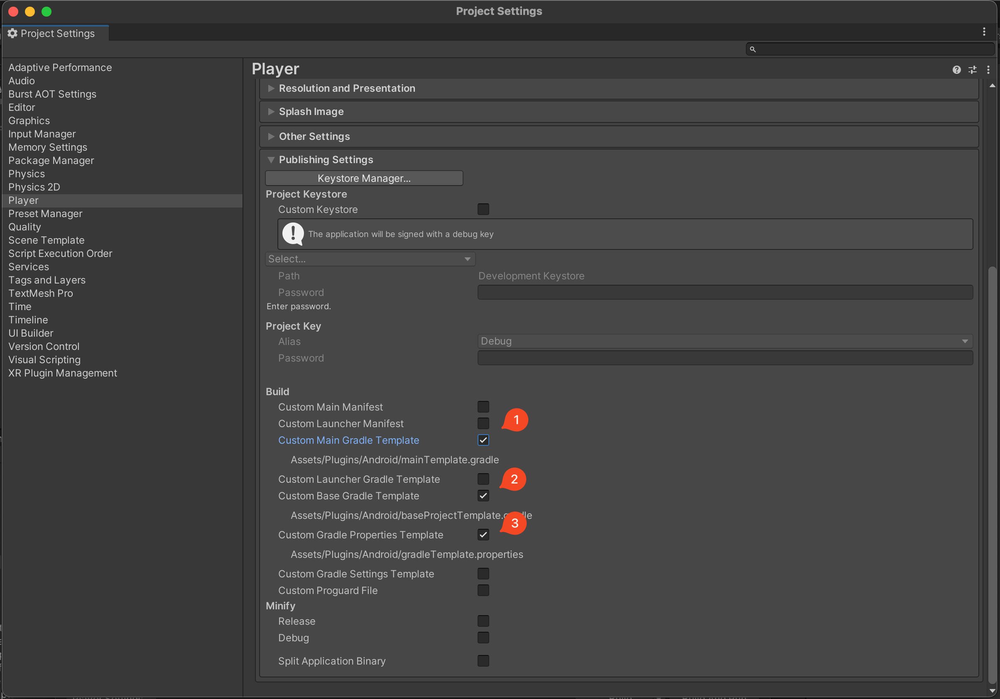

# Unity SDK

## Installation

### **Unity Package Manager**

From the Unity Package Manager window:

* Add Package from Git url

```html
https://github.com/Purchasely/Unity-Package.git
```

### API Key

From the Purchasely package window (Windows -> Purchasely):

* Set the API Key field to your Purchasely API Key

### External Dependencies Manager

A third party external package is necessary to handle external dependencies with Cocoapods for iOS and Gradle for Android

* Got to _Assets_ → _Import package_ → _Custom package_
* Find and add _**external-dependency-manager-latest.unitypackage**_ from [https://github.com/googlesamples/unity-jar-resolver](https://github.com/googlesamples/unity-jar-resolver)

You can also use [Unity Package Manager](https://openupm.com/packages/com.google.external-dependency-manager/) to install it

### Troubleshoot

If you have difficulties building your Unity project with Purchasely Package, please make sure to follow all those steps and [External Dependency Manager](flutter-sdk-1.md#external-dependencies-manager) is installed on your project

#### Resolve on build or automatically

In _Assets -> External Dependency Manager -> Android Resolver > Settings_ make sure that **Resolution On Build** and/or Auto Resolution are checked as well as **patch gradleTemplate.properties**



#### Add custom gradle files

To allow dependency manager to work properly, it may be required to add custom gradle files to your project. You can do that in a few clicks

_File -> Build Settings -> Android -> Player Settings -> Publishing Settings_

You need to check

* Custom Gradle Properties Template

If it is still not working, we suggest to check also the following

* Custom Main Gradle Template
* Custom Base Gradle Template



#### Remove included AAR or APK

If you have a duplicate class issue, it may be due to AAR or APK included directly in your Project. Unity may add them directly, you can look in Project window and _Assets -> Plugin -> Android_\
If you have some `aar` files, mainly the ones starting with _androidx_, included there, you should remove them as Purchasely already integrate them and they are the ones causing this conflict error

#### Clean Build

After including or updating Purchasely Unity Package, you should do a **Clean Build** in _File -> Build Settings -> Android_ to make sure that the latest Purchasely android dependencies are fetched by your project
