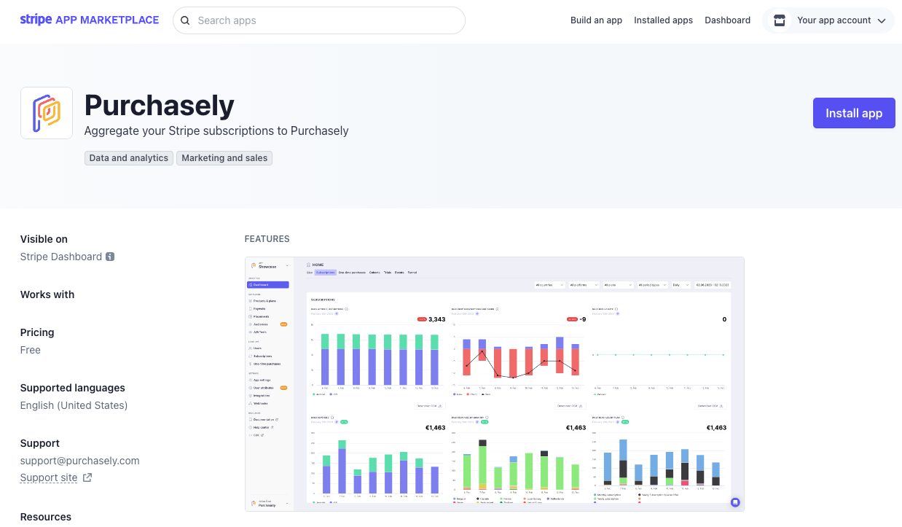
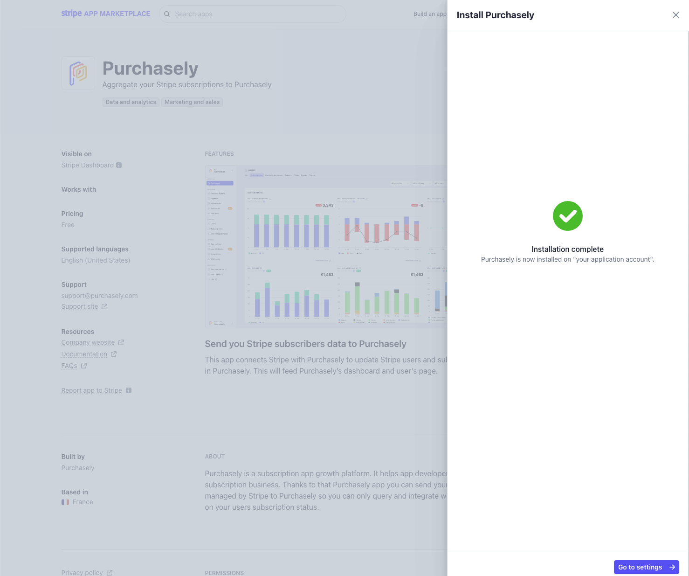
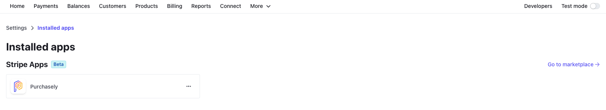
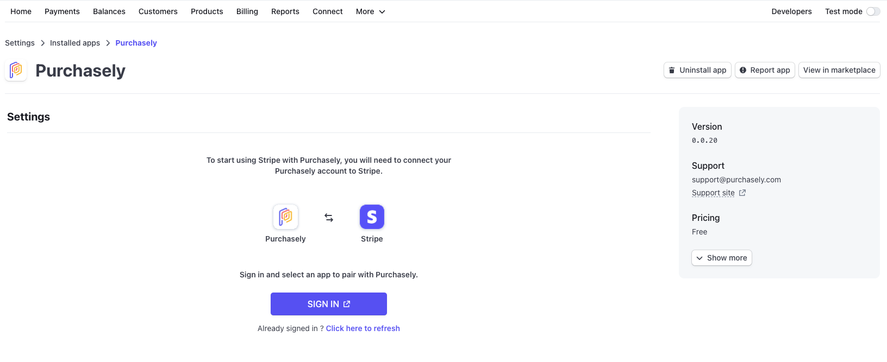
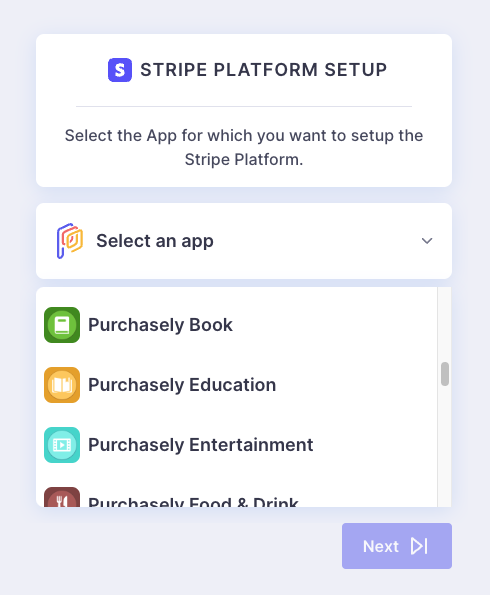
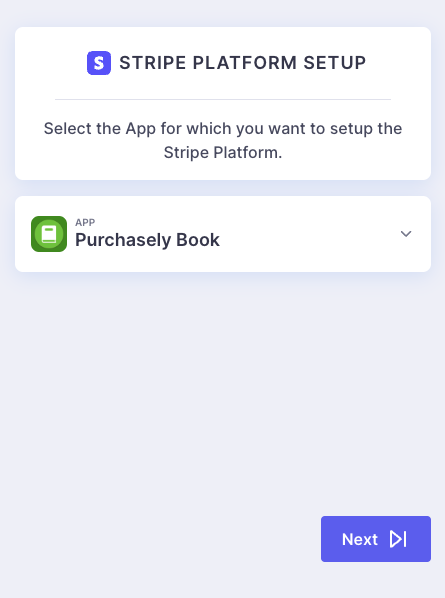
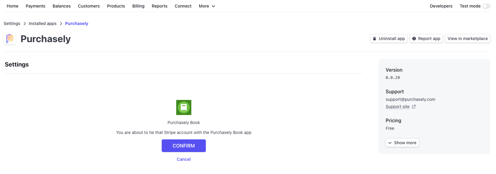
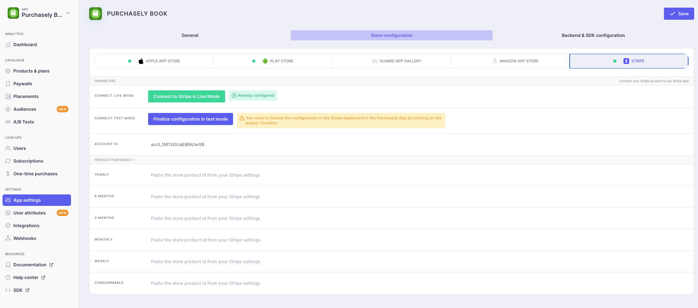
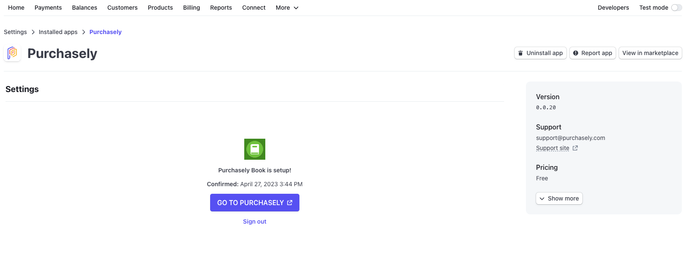
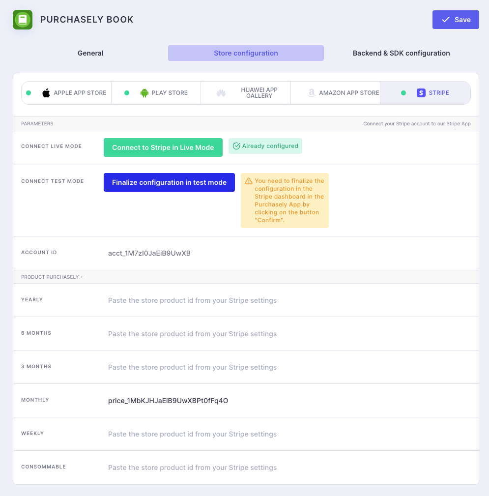

# Stripe (beta)

Installation of Stripe in Purchase is performed in 4 steps

## I. Installing the Stripe App

Go to the Purchasely's app listing on [Stripe apps marketplace](https://marketplace.stripe.com/apps/purchasely)

<figure><figcaption><p>Stripe app market place listing</p></figcaption></figure>

If you have more than one Stripe account (for each application) then connect the account you want to associate with the application.


⚠️ A Stripe application combines a Stripe account with only one Purchasely mobile application. If your Stripe account works with more than one application, please contact our support team via Intercom.


Click on install app.\
The list of authorisations required for the proper functioning of our application is then displayed.

<figure><figcaption><p>Authorisation validation</p></figcaption></figure>


If you have a question about the use of an authorisation, contact our support team via Intercom.


Validate the authorisations requested

<figure><figcaption><p>Permission samples</p></figcaption></figure>

The installation is complete, you can proceed with the configuration.

<figure><figcaption><p>Successful installation</p></figcaption></figure>

## II. Configuration of the Stripe app

Once the Stripe Purchasely app is installed you need to configure it.\
Go to the Stripe console in **Settings > installed apps > Purchasely**.

<figure><figcaption><p>Settings</p></figcaption></figure>

<figure><figcaption><p>Settings > installed apps</p></figcaption></figure>

### II.1. Associate with Purchasely

Once on the app configuration you need to associate it with your Purchasely account and app. To do this, start by clicking on "SIGN IN".

<figure><figcaption><p>Settings > installed apps > Purchasely</p></figcaption></figure>

Select the Purchasely app you wish to link your Stripe account to.

Click on "NEXT".


⚠️ A Stripe account can only be associated with one and only one Purchasely mobile application. A Purchasely mobile application can only be associated with one Stripe application. If your Stripe account works with several applications, please contact our support team via Intercom.


<div>

<figure><figcaption><p>App Selection</p></figcaption></figure>

 

<figure><figcaption><p>App Selected</p></figcaption></figure>

</div>

### II.2 Confirm Stripe app link with your mobile application

Once you have selected the application, you will be redirected to Stripe to finalise the configuration by clicking on "CONFIRM".

<figure><figcaption><p>confirmation screen</p></figcaption></figure>

The app will appear as below when properly configured in Purchasely and Stripe.

<figure><figcaption><p>Purchasely App Settings</p></figcaption></figure>

<figure><figcaption><p>Stripe App settings - configured</p></figcaption></figure>

## III. Configuration of plans

In order for Purchasely to associate Stripe products, they must be defined in the plans. Also you must associate each **Pricing** Stripe to a Purchasely Plan otherwise the purchase will not be taken into account by Purchasely.

From the Stripe console, copy the API ID (price) ...

<figure><figcaption></figcaption></figure>

... then paste this ID into the corresponding plan or directly from the Stripe store configuration.

<figure><figcaption></figcaption></figure>

## IV. Associating Stripe subscriptions to Purchasely

This last step allows Purchasely to retrieve and associate a purchase with a user.

[The principle is the same as for the migration of an existing subscriber](https://docs.purchasely.com/faq/migration-guides/migrate-from-an-existing-setup#2.-send-us-every-new-subscription-created-on-you-side-with-a-call-on-our-api)

To send us this information, simply call our API and provide it with

* `stripe_object_id`: the Stripe subscription ID
* `stripe_price_id`: the Stripe Price Id for this subscription (ON STRIPE)
* `user_id`: the user\_id associated with the purchase, the same as you enter in [the SDK during configuration.](https://docs.purchasely.com/quick-start-1/sdk-configuration/config-appendices/set-user-id)
* `stripe_object_type`: the type of Stripe object sent, currently we only accept `subscription`

```bash
curl \
  --request POST \
  -i \
  -H "Content-Type: application/json" \
  -H "X-API-KEY:{{YOUR_API_KEY}}" \
  -H "X-PLATFORM-TYPE:STRIPE" \
  --data '{"stripe_object_id":"{{STRIPE_SUBSCRIPTION_ID}}","stripe_price_id":"{{STRIPE_PRICE_ID_FOR_THIS_SUBSCRIPTION}}", "user_id":"{{SAME_ID_AS_IN_SDK_CONFIGURATION}}", "stripe_object_type":"subscription"}' \
  https://s2s.purchasely.io/receipts
```

Example request:

```bash
curl \
  --request POST \
  -i \
  -H "Content-Type: application/json" \
  -H "X-API-KEY:AAAAAAAA-BBBB-CCCC-DDDD-EEEEEEEEEEEE" \
  -H "X-PLATFORM-TYPE:STRIPE" \
  --data '{"stripe_object_id":"sub_1MluxqJaEiB9UwXB34gmtzCB","stripe_price_id":"price_1MbKJHJaEiB9UwXBPt0fFq4O", "user_id":"jdo-cus_Msq9YfCiFkFzVx", "stripe_object_type":"subscription"}' \
  https://s2s.purchasely.io/receipts
```


You can export a list of your Stripe's subscriptions with their associated prices from your Stripe Stripe dashboard.\
On Stripe go under:\
Billing > Subscription > Export\
Select: Custom and keep only "ID" and "Plan"


<figure><figcaption></figcaption></figure>


