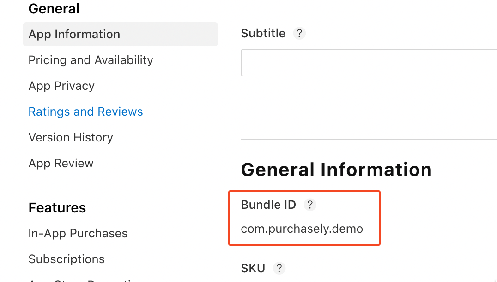
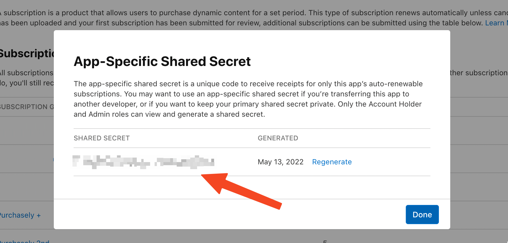
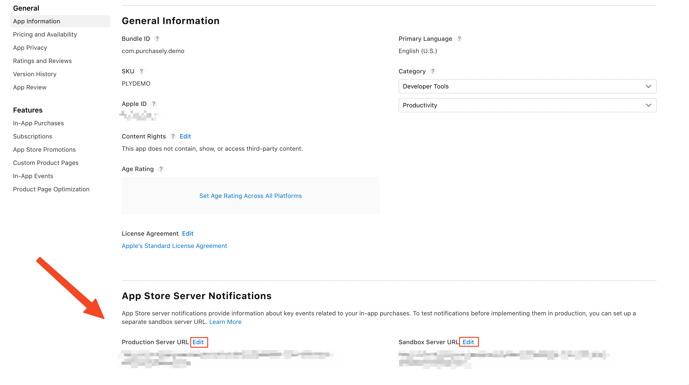
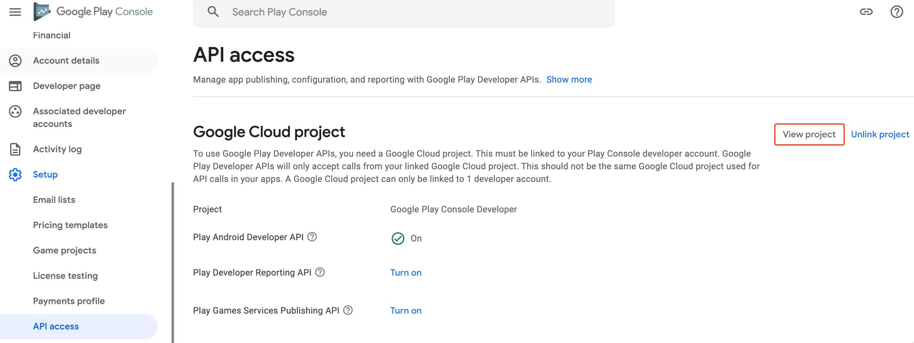
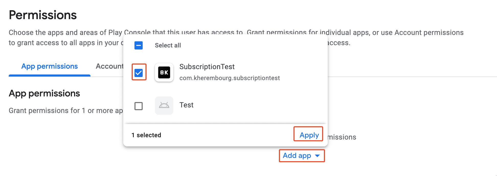
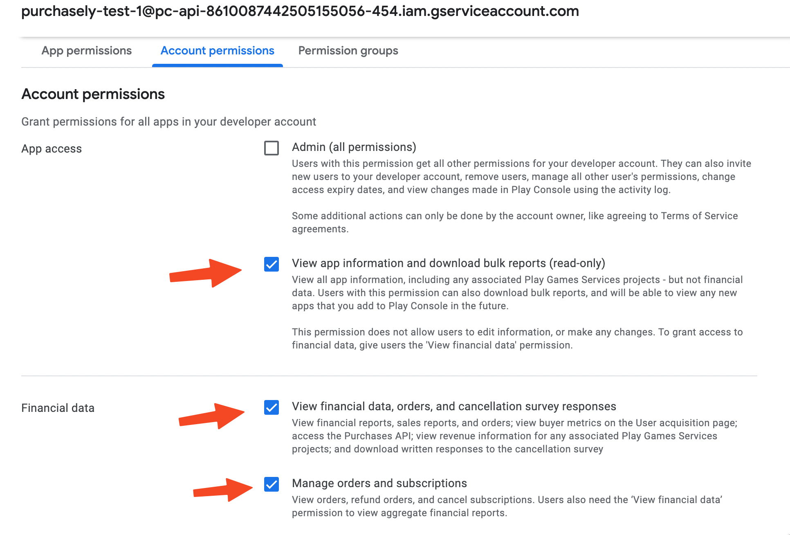

# Console Configuration

This is a simplified overview of our more detailed [console configuration](console-configuration/installation.md#creating-a-new-app)

### Application

<figure><figcaption>
Create a New Application
</figcaption></figure>

The mandatory parameters are :

* **Name**: the name of the application as it will be displayed in the Purchasely Console
* **The default language**:  this will define which language shall be used when the language on a user device is not supported by the application. ⚠️ It can't be changed later

<figure><figcaption>
Store Configuration
</figcaption></figure>

The next step is to plug your applications with the different stores you want to use.

### Apple App Store

By clicking on the Apple App Store tab in your App Settings you can do the 3 required steps for Apple configuration

1. App bundle id\
   
2. Shared App Secret\
   
3. Server to Server notifications\
   

### Google Play Console

By clicking on the Play Store tab in your App Settings you can do the 3 required steps for Google configuration

#### App Bundle Id 

#### Access Key

Create a dedicated Service Account under [Google Cloud Platform Console](https://console.cloud.google.com/) [https://console.cloud.google.com](https://console.cloud.google.com/) \
_Google Cloud Platform > IAM & admin > Service Account > Create a new Service Account_

* Name your account `Purchasely` to be able to easily identify it later
* Give it the ID `purchasely`
* On the following screen, set the role to "Owner"
* On the following screen, create a key by clicking on the `+ Create a key` button
* Choose JSON format
* Fill the content of the field "Access key" with this json file

Grant the access to the Service Account under the [Google Play Console](https://play.google.com/console/u/0/developers/api-access)\
_Google Play Console> API Access > \[PURCHASELY SERVICE ACCOUNT] > Grant authorization_

**Complete those 3 steps**

1. Set "no expiration date"
2. **Tab: App permissions -** Select the application corresponding to the app bundle id\
   
3. **Tab: Account permissions -** Ensure the following permissions are selected :
   * [x] View app information and download bulk reports
   * [x] View financial data, orders, and cancellation survey responses
   * [x] Manage orders and subscriptions\
     \


Once you have completed all those steps, it can **take up from 30 minutes to 48 hours** to Google to activate those new permissions, specifically the 2nd step **App Permission** for the service account


#### Server to Server notifications

We connect to Google Cloud Pub/Sub automatically for you by using your service account access.\
All you need to do is click on "Connect to Google" and follow the steps

