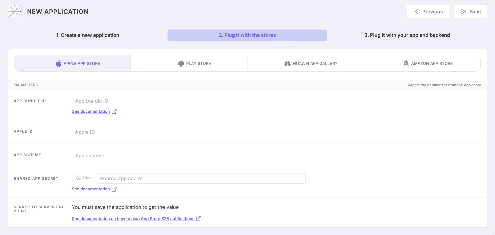

# Console Configuration

This is a simplified overview of our more detailed [console configuration](console-configuration/installation.md#creating-a-new-app)

### Application

<figure><figcaption>
Create a New Application
</figcaption></figure>

The mandatory parameters are :

* **Name**: the name of the application as it will be displayed in the Purchasely Console
* **The default language**: this will define which language shall be used when the language on a user device is not supported by the application. ⚠️ It can't be changed later
*

    <figure><figcaption>
Store Configuration
</figcaption></figure>

The next step is to plug your applications with the different stores you want to use.

### Apple App Store

By clicking on the Apple App Store tab in your App Settings you can do the 3 required steps for Apple configuration

**App bundle id**\

**Shared App Secret**\

**Store Kit 2**

By default Purchasely SDK uses Store Kit 2, you need to grant us a specific access to your In-App Purchases for our service to work\
Please follow [this guide](../quick-start-1/sdk-configuration/storekit-2.md) to configure Store Kit 2 with Purchasely


You can use Store Kit 1 if you want, just skip this step and make sure that [Purchasely.start()](sdk-implementation.md) is configured with Store Kit 1


**Server to Server notifications**\

### Google Play Console

You will need to follow those steps:

1. Set your [Android App Bundle Id](console-configuration/installation.md#android-app-bundle-id)
2. [Create](console-configuration/installation.md#access-key-json) the Service Account
3. [Grant Access](console-configuration/installation.md#grant-access-to-the-new-service-account) to the Service Account


Once you have completed all those steps, it can **take up from 30 minutes to 48 hours** to Google to activate those new permissions, specifically the 2nd step **App Permission** for the service account


#### Server to Server notifications

We connect to Google Cloud Pub/Sub automatically for you by using your service account access.\
All you need to do is click on "Connect to Google" and follow the steps

<figure><figcaption></figcaption></figure>
